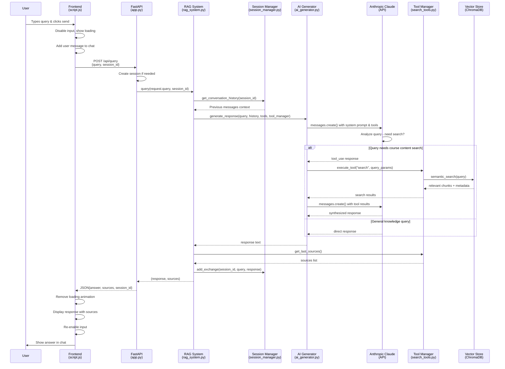

# RAG System Query Flow Diagram

## Key Components:

### Frontend Layer
- **User Interface**: Chat input, loading states, message display
- **Session Management**: Tracks currentSessionId for conversation continuity
- **API Communication**: Handles HTTP requests/responses

### Backend API Layer  
- **FastAPI Router**: `/api/query` endpoint with request validation
- **Error Handling**: HTTP exceptions and status codes
- **Response Formatting**: Structured JSON responses

### RAG Core Layer
- **Orchestration**: Coordinates all system components
- **Tool Integration**: Manages search tool availability
- **Context Assembly**: Combines query, history, and tools

### AI Processing Layer
- **Claude Integration**: Anthropic API calls with tool support
- **Tool Execution**: Handles tool_use responses automatically
- **Response Synthesis**: Combines search results into coherent answers

### Data Layer
- **Vector Database**: ChromaDB for semantic search
- **Session Storage**: Conversation history persistence
- **Document Processing**: Pre-chunked course materials

## Flow Characteristics:
- **Intelligent Tool Usage**: Claude decides when to search vs. use general knowledge
- **Context Preservation**: Session management maintains conversation history  
- **Semantic Search**: Vector similarity matching for relevant content retrieval
- **Error Resilience**: Graceful handling of failures at each layer
- **Real-time UI**: Loading states and progressive disclosure of results